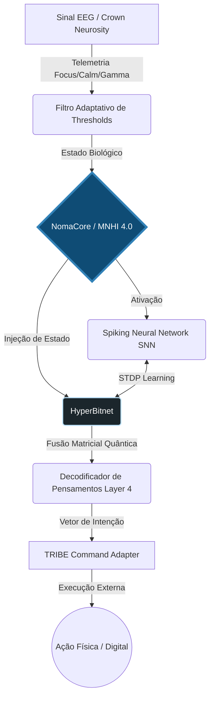

<div align="center">
  <h1>Sincronia Bio-Sintética Subliminar (SBSS)</h1>
  <p><b>MNHI 4.0 Unified Runtime • Brain-AI Bridge • NomaCore</b></p>
  
  [](https://www.python.org/)
  [](#)
  [](#)
  [](#)
</div>

<br/>

> *"Unir não é mesclar. É fazer duas frequências baterem em fase."*

A **Sincronia Bio-Sintética Subliminar (SBSS)** (antigamente conhecida como *brain-ia-bridge*) é uma infraestrutura avançada de **simbiose humano-máquina**. Ela atua como uma ponte de integração bidirecional entre telemetria de EEG (Crown/Neurosity), topologias de redes lógicas hiper-dimensionais (HyperBitnet) e sistemas externos de execução (TRIBE).

O propósito da SBSS é decodificar a intenção e modular a sincronia entre a máquina e o operador biológico em tempo real, utilizando inferência contínua, fusão matricial e redes neurais pulsantes (Spiking Neural Networks).

---

## ✨ Principais Capacidades

- 🧠 **Decodificação de Intenção (EEG):** Calibração adaptativa baseada no estado de repouso (baseline) extraindo marcadores de foco, calma e ondas gama.
- ⚡ **Redes Neurais Pulsantes (SNN):** Motor de alta performance implementado em C++ (com fallback para Python) utilizando modelos Leaky Integrate-and-Fire e plasticidade sináptica (STDP).
- 🌌 **HyperBitnet (Simulação Quântica-Inspirada):** Matrizes eficientes inspiradas no modelo BitNet 1.58b fundidas a grafos quânticos para processar estados abstratos.
- 🔗 **NomaCore & MNHI 4.0:** O coração dinâmico em tempo real do sistema, responsável pelo rastreamento da memória sináptica, telemetria *NOMA_NEURAL* e estados vitais.
- 🕹️ **Integração TRIBE:** Tradução fluida das intenções puras decodificadas para comandos de atuação de alto nível.

---

## 🏗 Arquitetura

A SBSS segue uma arquitetura baseada em **degradação graciosa** (Graceful Degradation). O sistema roda perfeitamente em ambientes Python puros, mas acelera brutalmente sua performance ao encontrar bibliotecas científicas (`numpy`, `networkx`, `scipy`) ou bibliotecas compiladas (`pybind11`).



---

## 🚀 Guia de Operação

### Instalação

```bash
# 1. Crie e ative um ambiente virtual
python -m venv .venv
source .venv/bin/activate  # ou .venv\Scripts\Activate.ps1 no Windows

# 2. Instale as dependências
pip install -r requirements.txt
```

### Modos de Execução

A arquitetura MNHI 4.0 foi consolidada no ponto de entrada principal: `src/main.py`.

#### 1. Runtime Contínuo (NomaCore)
Executa a malha base do cérebro simulado, processando ciclos a cada 100ms. O estado de memória é serializado continuamente.
```bash
python src/main.py
```

#### 2. Demo MVP (Calibração e Inferência)
Fase 1 do SBSS. Processa 30 janelas de baseline para calibração, estabelece thresholds de *focus* e *calm*, e gera saídas TRIBE.
```bash
python src/main.py --demo
```

#### 3. Simulação Avançada (HyperBitnet)
Ativa as capacidades completas de fusão vetorial e matrizes BitNet. Exige as dependências matemáticas (numpy, scipy, networkx).
```bash
python src/main.py --advanced
```

---

## 🧬 Observabilidade e Simbiose

A interface gráfica de alta-frequência **Mind Panel** e os *loops* de simbiose permitem acompanhar o funcionamento da rede em tempo real.

**Visualizar o Cérebro em Tempo Real:**
```bash
python src/mind_panel.py --state-file src/mind_panel_state.json
```
*(Acesse [http://127.0.0.1:8765](http://127.0.0.1:8765) no navegador)*

**Alimentar Telemetria NOMA:**
```bash
python src/run_noma_symbiosis.py
```
*(Aceita blocos `[NOMA_NEURAL]...[/NOMA_NEURAL]` na entrada padrão para modulação direta da rede).*

---

## ⚠️ Governança e Ética (Pentacosagram)

A SBSS inclui módulos de governança algorítmica (`pentacosagram.py`) para limitar derivas semânticas indesejadas e garantir a segurança das decodificações. 

> [!CAUTION]
> **Aviso Importante:** Este projeto é **experimental** e focado em pesquisa e educação tecnológica. 
> - **Não utilize** para diagnósticos médicos.
> - **Não utilize** para controle de maquinário crítico sem protocolos formais de validação (Safety Protocol Nível 4).
